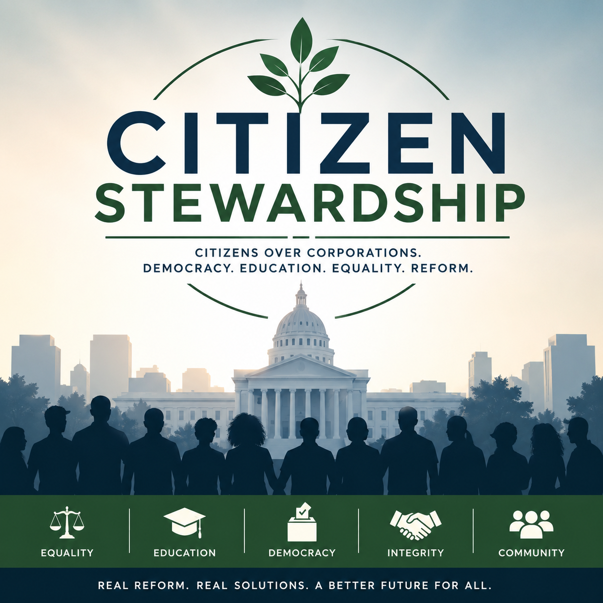

# Citizen Stewardship

[**Visit CitizenStewardship.org**](https://citizenstewardship.org)



Citizen Stewardship is a nonpartisan, citizen-created civic project focused on American democratic renewal, practical reform, public accountability, civil liberties, and informed civic participation.

**Created, designed, and developed by James Ramsey.**

## Project overview

Citizen Stewardship was built to turn complex civic reform ideas into a public, readable, and participatory digital project. The site publishes two reform proposals, provides plain-language context around them, and gives citizens structured ways to question, criticize, and improve the work.

The project is intentionally independent. It is not a political party, PAC, campaign committee, government entity, or formal nonprofit organization.

## What I built

- A custom responsive website built with Astro and TypeScript.
- A component-based design system for consistent navigation, page layouts, proposal cards, calls to action, social links, and sharing tools.
- Two public proposal hubs with downloadable PDF versions of the full reform drafts.
- A public review and submission workflow using GitHub Discussions.
- A structured GitHub Discussion form for citizen-submitted reform ideas and corrections.
- A contact workflow using Formspree without requiring a custom application backend.
- Search and social metadata including canonical URLs, Open Graph metadata, social preview imagery, and sitemap generation.
- Native sharing and copy-link functionality without third-party sharing widgets.
- Privacy-conscious architecture that avoids advertising trackers, analytics scripts, user accounts, and a custom user database.

## Architecture

Citizen Stewardship is designed as a static-first site. The public website does not require its own application server, user account system, or database.

Third-party services are limited to specific public-facing functions:

- **Cloudflare** for hosting and delivery.
- **GitHub Discussions** for public discussion and proposal submissions.
- **Formspree** for private contact-form delivery.

The site itself does not intentionally use advertising analytics, client-side tracking, or tracking cookies.

## Tech stack

- Astro 6
- TypeScript
- HTML and CSS
- Cloudflare
- GitHub Discussions
- Formspree

## Public participation

GitHub Discussions is used as the public forum because it provides a transparent and organized record of proposal feedback. The repository includes a structured submission form at `.github/DISCUSSION_TEMPLATE/public-submissions.yml` so participants can submit ideas without needing to understand the codebase.

Public discussion categories include:

- Proposal One Discussion
- Proposal Two Discussion
- Public Submissions
- Community Submissions
- Site Improvements
- General Civic Discussion

## Key site routes

- `/` - project overview
- `/proposal-one/` - long-range democratic renewal proposal
- `/proposal-two/` - practical reform proposal
- `/community/` - public participation and discussion
- `/submit/` - submission guidance
- `/about/` - project background
- `/contact/` - contact options
- `/privacy/` - privacy policy
- `/terms/` - terms of use

## Proposal documents

The current public proposal PDFs are stored in `public/assets/pdfs/`:

- `democratic-renewal-full-proposal.pdf`
- `feasible-democratic-reform-proposal.pdf`

## Local development

Requires Node.js 22 or later.

```bash
npm ci
npm run dev
```

Create a production build:

```bash
npm run build
```

The generated site is written to `dist/`.

## Project structure

```text
.github/                 GitHub community and automation configuration
src/components/          Reusable Astro components
src/layouts/             Shared site layouts
src/pages/               Public site routes
src/styles/              Global styles
public/assets/images/    Project graphics
public/assets/pdfs/      Public proposal documents
public/fonts/            Locally served font files
```

## Privacy and security

Local environment files and Wrangler development variables are excluded by `.gitignore`. Do not commit credentials, API keys, private contact data, or other secrets to this repository.

The Formspree form identifier used by the public contact page is client-side configuration and is intentionally visible in the source.

## Licensing

The original source code in this repository is available under the terms described in [`LICENSE`](LICENSE).

That source-code license does **not** automatically grant reuse rights to Citizen Stewardship proposal text, editorial content, PDFs, logos, graphics, branding, or third-party materials. See the license file for details.

## Contact

Public project email: **contact@citizenstewardship.org**
